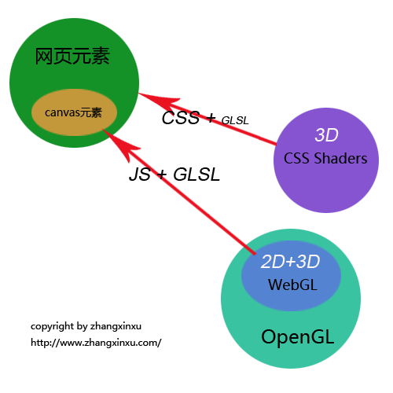

# Canvas


Canvas是HTML5新增的组件，它就像一块幕布，可以用JavaScript在上面绘制各种图表、动画等。
没有Canvas的年代，绘图只能借助Flash插件实现，页面不得不用JavaScript和Flash进行交互。有了Canvas，我们就再也不需要Flash了，直接使用JavaScript完成绘制。
一个Canvas定义了一个指定尺寸的矩形框，在这个范围内我们可以随意绘制。

```javascript
  
    <canvas id="canvas1" width="1000" height="440">Canvas not supported</canvas>
  
```
## 案例
一个基于canvas的动画
<ClientOnly>
    <canvas-example/>
</ClientOnly>

## Canvas 坐标
原点位于左上角, x 轴横向向右,  Y 轴竖向向下为正方向.
canvas元素默认被网格所覆盖。通常来说网格中的一个单元相当于canvas元素中的一像素。栅格的起点为左上角（坐标为（0,0））。所有元素的位置都相对于原点来定位。所以图中蓝色方形左上角的坐标为距离左边（X轴）x像素，距离上边（Y轴）y像素（坐标为（x,y)。


## 绘制
canvas只支持一种原生的 图形绘制：矩形。所有其他图形都至少需要生成一种路径(path)。
* 画矩形
```javascript
function drawRect(){
    var canvas = document.getElementById('tutorial');
    if(!canvas.getContext) return;
    var ctx = canvas.getContext("2d");
    ctx.fillRect(10, 10, 100, 50);  //绘制矩形,填充的默认颜色为黑色
    ctx.strokeRect(10, 70, 100, 50);  //绘制矩形边框
    
}
```
矩形：
<ClientOnly>
    <rect-example/>
</ClientOnly>
* 绘制路径
  
```javascript
function drawLine(){
    var canvas = document.getElementById('tutorial');
    if (!canvas.getContext) return;
    var ctx = canvas.getContext("2d");
    ctx.beginPath(); //新建一条path
    ctx.moveTo(50, 50); //把画笔移动到指定的坐标
    ctx.lineTo(200, 50);  //绘制一条从当前位置到指定坐标(200, 50)的直线.
    //闭合路径。会拉一条从当前点到path起始点的直线。如果当前点与起始点重合，则什么都不做
    ctx.closePath();
    ctx.stroke(); //绘制路径。
}
function drawTriangle(){
    var canvas = document.getElementById('tutorial');
    if (!canvas.getContext) return;
    var ctx = canvas.getContext("2d");
    ctx.beginPath();
    ctx.moveTo(50, 50);
    ctx.lineTo(200, 50);
    ctx.lineTo(200, 200);
   
    ctx.fill(); //填充闭合区域。如果path没有闭合，则fill()会自动闭合路径。
}
```
绘制路径：
<ClientOnly>
    <path-example/>
</ClientOnly>

## 贝塞尔曲线

* 二次贝塞尔曲线: 由两个锚点和一个控制点组成quadraticCruveTo(double cpx, double cpy, double x, double y)
```javascript
function draw(){
    var canvas = document.getElementById('tutorial');
    if (!canvas.getContext) return;
    var ctx = canvas.getContext("2d");
    ctx.beginPath();
    ctx.moveTo(10, 200); //起始点
    var cp1x = 40, cp1y = 100;  //控制点
    var x = 200, y = 200; // 结束点
    //绘制二次贝塞尔曲线
    ctx.quadraticCurveTo(cp1x, cp1y, x, y);
    ctx.stroke();
    
    ctx.beginPath();
    ctx.rect(10, 200, 10, 10);
    ctx.rect(cp1x, cp1y, 10, 10);
    ctx.rect(x, y, 10, 10);
    ctx.fill();
    
}
```
* 三次方贝塞尔曲线：创建一条代表三次方贝塞尔曲线的路径. bezierCurveTo(double cpx, double cpy, double cp2x, double cp2y, double x, double y)
```javascript
function draw(){
    var canvas = document.getElementById('tutorial');
    if (!canvas.getContext) return;
    var ctx = canvas.getContext("2d");
    ctx.beginPath();
    ctx.moveTo(40, 200); //起始点
    var cp1x = 20, cp1y = 100;  //控制点1
    var cp2x = 100, cp2y = 120;  //控制点2
    var x = 200, y = 200; // 结束点
    //绘制二次贝塞尔曲线
    ctx.bezierCurveTo(cp1x, cp1y, cp2x, cp2y, x, y);
    ctx.stroke();

    ctx.beginPath();
    ctx.rect(40, 200, 10, 10);
    ctx.rect(cp1x, cp1y, 10, 10);
    ctx.rect(cp2x, cp2y, 10, 10);
    ctx.rect(x, y, 10, 10);
    ctx.fill();

}
draw();
```
贝塞尔曲线：
<ClientOnly>
    <bezier-example/>
</ClientOnly>

## 绘制文本
```javascript
var ctx;
function draw(){
    var canvas = document.getElementById('tutorial');
    if (!canvas.getContext) return;
    ctx = canvas.getContext("2d");
    ctx.font = "100px sans-serif"
    ctx.fillText("天若有情", 10, 100);
    ctx.strokeText("天若有情", 10, 200)
}
draw();
```
## 绘制图片，切片


## Canvas save&&restore
canvas的API提供了两个名叫save()和restore()的方法，用于保存及恢复当前Canvas绘图环境的所有属性。其中save()可以保存当前状态，而restore()可以还原之前保存的状态。这两个方法再绘图中有着重要的作用，比如我们在绘图的时候需要使用多种颜色，颜色需要不时的切换。那么使用save()和restore()方法即可比较方便的实现此功能。
保存的信息包含：
1. 当前的坐标变换（变换矩阵）信息，比如旋转或平移时使用的rotate()和setTransform()方法
2. 当前剪贴区域
3. 图形上下文对象（CanvasRenderingContext2D）的当前属性值

## 坐标变换
1.平移 translate
2.旋转 rotate
3.scale 缩放坐标体系
4. transform

```javascript
function draw() {
   context.save();

   skyOffset = skyOffset < canvas.width ?
               skyOffset + SKY_VELOCITY/fps : 0;

   grassOffset = grassOffset < canvas.width ?
                 grassOffset +  GRASS_VELOCITY/fps : 0;

   treeOffset = treeOffset < canvas.width ?
                treeOffset + TREE_VELOCITY/fps : 0;

   nearTreeOffset = nearTreeOffset < canvas.width ?
                    nearTreeOffset + FAST_TREE_VELOCITY/fps : 0;

   context.save();
   context.translate(-skyOffset, 0);
   context.drawImage(sky, 0, 0);
   context.drawImage(sky, sky.width-2, 0);
   context.restore();

   context.save();
   context.translate(-treeOffset, 0);
   context.drawImage(tree, 100, 240);
   context.drawImage(tree, 1100, 240);
   context.drawImage(tree, 400, 240);
   context.drawImage(tree, 1400, 240);
   context.drawImage(tree, 700, 240);
   context.drawImage(tree, 1700, 240);
   context.restore();

   context.save();
   context.translate(-nearTreeOffset, 0);
   context.drawImage(nearTree, 250, 220);
   context.drawImage(nearTree, 1250, 220);
   context.drawImage(nearTree, 800, 220);
   context.drawImage(nearTree, 1800, 220);
   context.restore();

   context.save();
   context.translate(-grassOffset, 0);

   context.drawImage(grass, 0, canvas.height-grass.height);

   context.drawImage(grass, grass.width-5,
                     canvas.height-grass.height);

   context.drawImage(grass2, 0, canvas.height-grass2.height);

   context.drawImage(grass2, grass2.width,
                     canvas.height-grass2.height);
   context.restore();
}
```
## 合成
* source-over(default)


## 动画
1. setInterval
2. setTimeout
3. requestAnimationFrame 自行决定最佳的帧速率
   
setInterval或setTimeout实现的JavaScript动画的缺点就是可靠性不足，浏览器无法保证每一帧渲染的时间间隔，一般情况下，每秒平均刷新次数能够达到60帧，就能够给人流畅的体验，即每过 1000/60 毫秒渲染新一帧即可
为此，requestAnimationFrame应运而生，其作用就是让浏览器流畅的执行动画效果。可以将其理解为专门用来实现动画效果的api，通过这个api,可以告诉浏览器某个JavaScript代码要执行动画，浏览器收到通知后，则会运行这些代码的时候进行优化，实现流畅的效果，而不再需要开发人员烦心刷新频率的问题了。

```javascript
function animate(time) {
    //Update and draw animation objects
    requestAnimationFrame(animate)// sustatin the animation
}
requestAniamtionFrame
```

## 更多知识

Three.js webGL的封装
各大游戏动画引擎coco2d js

### 版权声明
[本文部分插图和文字节选自](https://blog.csdn.net/u012468376/article/details/73350998)