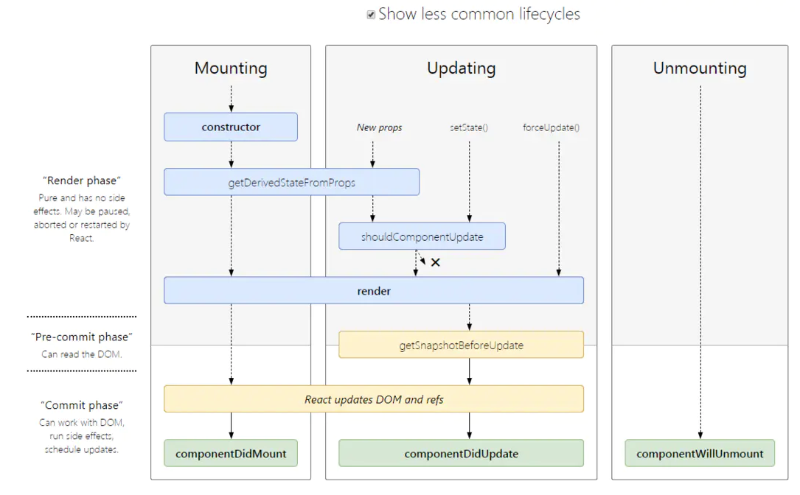

# React 经典面试题

## 虚拟DOM的优劣如何?
优点:

   1. 保证性能下限: 虚拟DOM可以经过diff找出最小差异,然后批量进行patch,这种操作虽然比不上手动优化,但是比起粗暴的DOM操作性能要好很多,因此虚拟DOM可以保证性能下限
   2. 提高生产效率: 虚拟DOM的diff和patch都是在一次更新中自动进行的,我们无需手动操作DOM,极大提高开发效率
   3. 抽象层面向js保证跨平台通用: 虚拟DOM本质上是JavaScript对象,而DOM与平台强相关,相比之下虚拟DOM可以进行更方便地跨平台操作,例如服务器渲染、移动端开发等等

缺点:

无法进行极致优化: 在一些性能要求极高的应用中虚拟DOM无法进行针对性的极致优化,比如VScode采用直接手动操作DOM的方式进行极端的性能优化
[本文节选自](https://juejin.cn/post/6844903922453200904)

## 虚拟DOM实现原理?
   1. 虚拟DOM本质上是JavaScript对象,是对真实DOM的抽象
   2. 状态变更时，记录新树和旧树的差异
   3. 最后把差异更新到真正的dom中

## React最新的生命周期是怎样的?
   1. 挂载阶段:
      1. constructor: 构造函数，最先被执行,我们通常在构造函数里初始化state对象或者给自定义方法绑定this
      2. getDerivedStateFromProps: static getDerivedStateFromProps(nextProps, prevState),这是个静态方法,当我们接收到新的属性想去修改我们state，可以使用getDerivedStateFromProps
      3. render: render函数是纯函数，只返回需要渲染的东西，不应该包含其它的业务逻辑,可以返回原生的DOM、React组件、Fragment、Portals、字符串和数字、Boolean和null等内容
      4. componentDidMount: 组件装载之后调用，此时我们可以获取到DOM节点并操作，比如对canvas，svg的操作，服务器请求，订阅都可以写在这个里面，但是记得在componentWillUnmount中取消订阅
   2. 更新阶段：
      1. getDerivedStateFromProps: 此方法在更新个挂载阶段都可能会调用
      2. shouldComponentUpdate: shouldComponentUpdate(nextProps, nextState),有两个参数nextProps和nextState，表示新的属性和变化之后的state，返回一个布尔值，true表示会触发重新渲染，false表示不会触发重新渲染，默认返回true,我们通常利用此生命周期来优化React程序性能
      3. render: 更新阶段也会触发此生命周期
      4. getSnapshotBeforeUpdate: getSnapshotBeforeUpdate(prevProps, prevState),这个方法在render之后，componentDidUpdate之前调用，有两个参数prevProps和prevState，表示之前的属性和之前的state，这个函数有一个返回值，会作为第三个参数传给componentDidUpdate，如果你不想要返回值，可以返回null，此生命周期必须与componentDidUpdate搭配使用
      5. componentDidUpdate: componentDidUpdate(prevProps, prevState, snapshot),该方法在getSnapshotBeforeUpdate方法之后被调用，有三个参数prevProps，prevState，snapshot，表示之前的props，之前的state，和snapshot。第三个参数是getSnapshotBeforeUpdate返回的,如果触发某些回调函数时需要用到 DOM 元素的状态，则将对比或计算的过程迁移至 getSnapshotBeforeUpdate，然后在 componentDidUpdate 中统一触发回调或更新状态。
    1. 卸载阶段
       1. componentWillUnmount: 当我们的组件被卸载或者销毁了就会调用，我们可以在这个函数里去清除一些定时器，取消网络请求，清理无效的DOM元素等垃圾清理工作



## setState到底是同步还是异步.
   1. 合成事件 异步
   2. 钩子函数 异步
   3. setTimeout 同步
   4. 原生事件 同步
什么是合成事件？
```jsx
class Test extends Component {
    constructor() {
        super(arguments);
        this.onReactClick.bind(this);
    }
    componentDidMount() {
        const parentDom = ReactDOM.findDOMNode(this);
        const childrenDom = parentDom.queneSelector(".button");
        childrenDom .addEventListen('click', this.onDomClick, false);
    }
    onDomClick() {  // 事件委托
        console.log('Javascript Dom click');
    }
    onReactClick() {  // react合成事件
        console.log('React click');
    }
    render() {
        <div>
            <button className="button" onClick={this.onReactClick()}>点击</button>
        </div>
    }
}
```