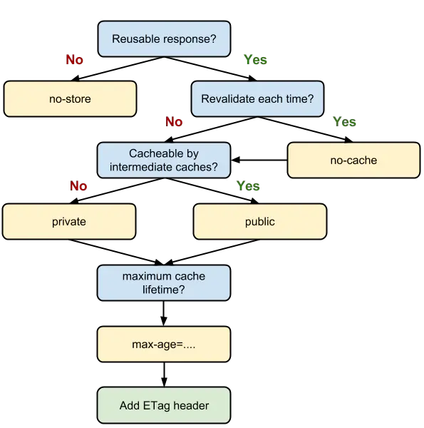

# Front-end performance optimization principle and practice

As the old saying goes, let us start with a classic "problem" from the front end.

## From entering the URL to the page loading, what happened?

From the perspective of performance optimization, we first use DNS to resolve the URL into an IP address, and then establish a TCP connection with the server identified by the IP address.
Then we throw our http request to the server. After the server processes our request, it puts the target data in the http response and returns it to the client.
After the client browser gets the response data, it can go through a rendering process, and the page is presented to the user in this way.
More detailed classification

1. DNS resolution
2. TCP connection
3. HTTP request throws
4. The server processes the request and the HTTP response is returned
5. The browser gets the response data, parses the response content, and displays (renders) the result of the analysis to the user

For any of our user-side products, we need to take these 5 processes into our own performance optimization plan without fail, and repeatedly weigh them, so as to polish the speed that users are satisfied with.

**In general, we will light up the skill tree for front-end performance optimization from two major dimensions: the network level and the rendering level**.


For the two steps of DNS resolution and TCP connection, front-end's impact is very limited. In contrast, the optimization of the HTTP connection level is the core of our network optimization. So we are straight to the point, grasping the main contradiction, and starting directly from HTTP.

HTTP optimization has two major directions:

* Reduce the number of requests
* Reduce the time spent on a single request

## webpack optimization

The optimization bottleneck of webpack is mainly in two aspects:

1. The webpack build process takes too much time
2. The result of webpack packaging is too big

### **Speeding up the construction process**

1. Don't let loader do too many things-> take babel-loader as an example(filter node_modules)

```javascript
module: {
  rules: [
    {
      test: /\.js$/,
      exclude: /(node_modules|bower_components)/,
      use: {
        loader:'babel-loader',
        options: {
          presets: ['@babel/preset-env']
        }
      }
    }
  ]
}
```
2. Optimize the construction of third-party libraries (avoid repeated packaging and reference of third-party libraries)

DllPlugin is created based on the idea of ​​Windows dynamic link library (dll). This plug-in will package the third-party library separately into a file, which is a purely dependent library. This dependency library will not be repackaged along with your business code, and will only be repackaged when the version of the dependency itself changes.

To process files with DllPlugin, there are two steps:

Based on the following dll exclusive configuration js file, package the third-party library into dll
```js
const path = require('path')
const webpack = require('webpack')

module.exports = {
    entry: {
      // Dependent library array
      vendor: [
        'prop-types',
        'babel-polyfill',
        'react',
        'react-dom',
        'react-router-dom',
      ]
    },
    output: {
      path: path.join(__dirname,'dist'),
      filename:'[name].js',
      library:'[name]_[hash]',
    },
    plugins: [
      new webpack.DllPlugin({
        // The name attribute of DllPlugin needs to be consistent with libary
        name:'[name]_[hash]',
        path: path.join(__dirname,'dist','[name]-manifest.json'),
        // context needs to be consistent with webpack.config.js
        context: __dirname,
      }),
    ],
}
```
There will be two such files vendor.js in our dist folder, without explanation, it is the result of our third-party library packaging. This extra vendor-manifest.json is used to describe the specific path corresponding to each third-party library.
Then, we only need to configure the dll slightly in webpack.config.js:

Based on webpack.config.js file, package business code
```js
const path = require('path');
const webpack = require('webpack')
module.exports = {
  mode:'production',
  // compile entry
  entry: {
    main:'./src/index.js'
  },
  // target document
  output: {
    path: path.join(__dirname,'dist/'),
    filename:'[name].js'
  },
  // dll related configuration
  plugins: [
    new webpack.DllReferencePlugin({
      context: __dirname,
      // manifest is the json file that we packaged in the first step
      manifest: require('./dist/vendor-manifest.json'),
    })
  ]
}
```

### **Build result volume compression**

1. Remove redundant code: UglifyJsPlugin plugin

```js
const UglifyJsPlugin = require('uglifyjs-webpack-plugin');
module.exports = {
 plugins: [
   new UglifyJsPlugin({
     // Allow concurrency
     parallel: true,
     // Turn on the cache
     cache: true,
     compress: {
       // delete all console statements
       drop_console: true,
       // Automatically define static values ​​that are used multiple times as variables
       reduce_vars: true,
     },
     output: {
       // Do not keep comments
       comment: false,
       // Make the output code as compact as possible
       beautify: false
     }
   })
 ]
}
```
2. Split resources
3. Load on demand
4. Gzip compression Extremely compress the size of the requested data

## **gzip optimization (www.zhongwei.tech)**

HTTP compression is a method built into web servers and web clients to improve transmission speed and bandwidth utilization. In the case of HTTP compression, the HTTP data is compressed before it is sent from the server: compatible browsers will announce which methods are supported to the server before downloading the required format; browsers that do not support the compression method will download Compressed data. The most common compression schemes include Gzip and Deflate.

HTTP compression is the process of re-encoding HTTP content for the purpose of reducing the size
The core of Gzip is Deflate, and Gzip is the one we use most for compressing files. It can be said that Gzip is a classic example of HTTP compression.

The static resource server built by nginx naturally supports the configuration of gzip. You only need to enable gzip compression according to the following configuration

nginx configuration
```
gzip on;
gzip_min_length 1k;
gzip_buffers 4 16k;
gzip_http_version 1.0;
gzip_comp_level 2;
gzip_types text/plain application/javascript application/css text/css application/xml text/javascript application/x-httpd-php image/jpeg image/gif image/png;
gzip_vary off;
gzip_disable "MSIE [1-6]\.";
```

Before
295kb transfered 224KB
After
1.4MB transfered 693 kB transferred

## **Picture optimization**
As far as the picture is concerned, we are not so much doing "optimization" as we are doing "weighing". Because what we have to do is to compress the size of the picture (or choose a smaller picture format from the beginning). But this optimization operation comes at the expense of a part of the imaging quality. Therefore, our main task is to find a balance between quality and performance as much as possible.
1. **JPEG/JPG** keywords: lossy compression, small size, fast loading, transparent JPG is suitable for presenting colorful pictures, in our daily development, JPG pictures are often used as large background pictures, carousel pictures or banners The graph appears.
Disadvantages: Lossy compression is really difficult to show off on the carousel, but when it processes images with strong lines and strong color contrasts such as vector graphics and logos, the image blur caused by artificial compression will be quite obvious. In addition, JPEG images do not support transparency processing, transparent images need to call PNG to render
2. **PNG-8 and PNG-24** lossless compression, high quality, large volume, support transparency. PNG images have stronger color expression than JPG, the processing of lines is more delicate, and there is good support for transparency. It makes up for the limitations of JPG we mentioned above, the only bug is that it is too large.
3. **SVG** text file, small size, no distortion, good compatibility
4. **Base64** keywords: text files, dependent coding, small icon solutions
Base64 is an encoding method used to transmit 8Bit bytecode. By Base64 encoding an image, we can directly write the encoding result into HTML or CSS, thereby reducing the number of HTTP requests.
5. **webP** WebP is the youngest among all kinds of picture formats in the audience today. It was proposed in 2010. It is a picture format developed by Google for the Web designed to speed up the loading of pictures. It supports lossy compression and lossless compression. WebP is as easy as JPEG for detailed pictures, it supports transparency like PNG, and can display dynamic pictures like GIF-it combines the advantages of multiple image file formats in one. Limitations: need high version browser support


## **Browser caching mechanism introduction and caching strategy analysis**

1. **MemoryCache**
The memory cache is fast and "short-lived". It is "dependent on life and death" with the rendering process. When the process ends, that is, after the tab is closed, the data in the memory will no longer exist. Whether resources are stored in memory or not, browsers adhere to the "saving principle", and only smaller resources can be stored in memory

2. **Service Worker Cache**
Service Worker is a Javascript thread independent of the main thread. It is separated from the browser window and therefore cannot directly access the DOM. This independent personality makes the service worker's "personal behavior" unable to interfere with the performance of the page. This "behind-the-scenes worker" can help us implement offline caching, message push and network proxy functions. The offline cache we implemented with the help of Service worker is called Service Worker Cache.

### http cache
Strong cache
1. Expire
2. Cache-Control


Expires allows us to control the cache expiration time through an absolute timestamp. Correspondingly, the max-age field in Cache-Control also allows us to achieve the same goal by setting a relative length of time.
```js
expires: Wed, 11 Sep 2019 16:12:18 GMT
```
```js
cache-control: max-age=31536000
```

### public and private
Public and private are a set of opposite concepts for whether resources can be cached by proxy services.
If we set public for the resource, it can be cached by the browser or the proxy server; if we set private, the resource can only be cached by the browser. private is the default value. But in most cases, public does not need to be manually set by us. For example, the cache-control of many online websites is like this:

### no-store and no-cache
1. no-cache After we set no-cache for the resource, every time we initiate a request, we will not ask about the browser’s cache, but will directly confirm to the server whether the resource has expired.
2. No-store, as its name implies, does not use any caching strategy. On the basis of no-cache, it bypasses the cache confirmation on the server side, and only allows you to send requests directly to the server side and download the complete response.

### Negotiate caching: the caching strategy under the cooperation of the browser and the server
Negotiation caching relies on the communication between the server and the browser.

Under the negotiated caching mechanism, the browser needs to ask the server for related information about the cache, and then determine whether to re-initiate the request, download the complete response, or obtain the cached resource locally.

If the server prompts that the cached resource has not been modified (Not Modified), the resource will be redirected to the browser cache. In this case, the status code corresponding to the network request is 304


### Negotiation cache implementation: from Last-Modified to Etag

1. Last-Modified
The first request for Response Headers returns:
```js
Last-Modified: Fri, 27 Oct 2017 06:35:57 GMT
```
Every time we request, we will bring a timestamp field called If-Modified-Since, its value is the last-modified value returned to it in the previous response:
```js
If-Modified-Since: Fri, 27 Oct 2017 06:35:57 GMT
```

### Last-Modified fallbacks:
1. We edited the file, but the content of the file has not changed. The server does not know whether we actually changed the file, it still judges by the last editing time. Therefore, when this resource is requested again, it will be treated as a new resource, which will trigger a complete response-when it should not be requested again, it will be requested again.

2. When we modify the file too fast (for example, it took 100ms to complete the change), because If-Modified-Since can only check the time difference in seconds as the smallest unit of measurement, it cannot perceive this change-the When re-requesting, instead of re-requesting.

### Etag 
In some cases as former said, the server does not correctly sense file changes. In order to solve this problem, Etag appeared as a supplement to Last-Modified.
Etag is a unique identification string generated by the server for each resource. This identification string is encoded based on the content of the file. As long as the content of the file is different, their corresponding Etag is different, and vice versa. Therefore, Etag can accurately perceive file changes.
The first request for Response Headers returns:
```js
ETag: W/"2a3b-1602480f459"
```
Then in the next request, a string named if-None-Match with the same value in the request header will be compared by the server:
```js
If-None-Match: W/"2a3b-1602480f459"
```
Etag is more accurate than Last-Modified in sensing file changes and has a higher priority. When Etag and Last-Modified exist at the same time, Etag shall prevail.

### Caching Decision Guide

