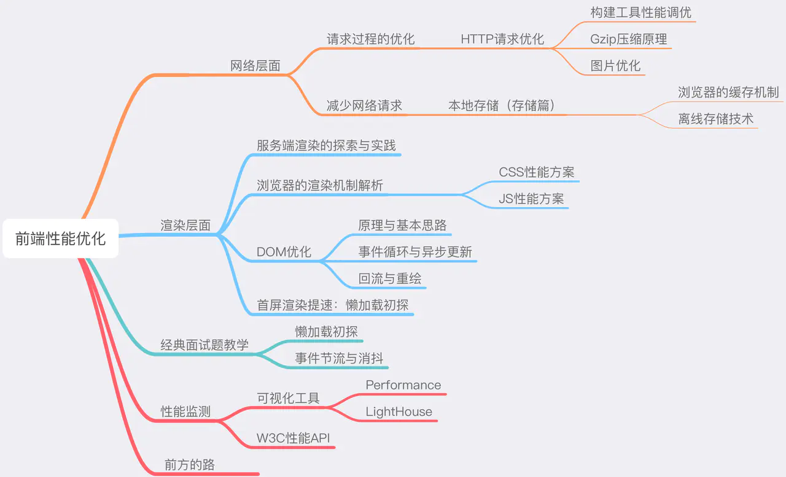

# 前端性能优化原理与实践

老生常谈， 让我们从一个前端经典的"问题".

## 从输入 URL 到页面加载完成，发生了什么？

站在性能优化的角度， 首选我们用DNS 将 URL　解析成IP地址，然后与IP地址确定的那台服务器建立TCP连接，
随后我们向服务端抛出我们的http请求，服务端处理完我们的请求后，把目标数据放在http响应里返回给客户端，
客户端浏览器拿到响应的数据后就可以走一个渲染的流程，页面便这样呈现给了用户。
更细节的分类

1. DNS 解析
2. TCP 连接
3. HTTP 请求抛出
4. 服务端处理请求，HTTP 响应返回
5. 浏览器拿到响应数据，解析响应内容，把解析的结果展示(渲染)给用户

我们任何一个用户端的产品，都需要把这 5 个过程滴水不漏地考虑到自己的性能优化方案内、反复权衡，从而打磨出用户满意的速度。

## 总的来说，我们将从网络层面和渲染层面两个大的维度来逐个点亮前端性能优化的技能树



对于 DNS 解析和 TCP 连接两个步骤，我们前端可以做的努力非常有限。相比之下，HTTP 连接这一层面的优化才是我们网络优化的核心。因此我们开门见山，抓主要矛盾，直接从 HTTP 开始讲起。

HTTP 优化有两个大的方向：

* 减少请求次数
* 减少单次请求所花费的时间

### webpack 优化

webpack 的优化瓶颈，主要是两个方面：

1. webpack 的构建过程太花时间
2. webpack 打包的结果体积太大

#### 构建过程提速策略

1. 不要让 loader 做太多事情——以 babel-loader 为例

```javascript
module: {
  rules: [
    {
      test: /\.js$/,
      exclude: /(node_modules|bower_components)/,
      use: {
        loader: 'babel-loader',
        options: {
          presets: ['@babel/preset-env']
        }
      }
    }
  ]
}
```
2. 优化第三方库构建(避免重复打包引用的第三方库)

DllPlugin 是基于 Windows 动态链接库（dll）的思想被创作出来的。这个插件会把第三方库单独打包到一个文件中，这个文件就是一个单纯的依赖库。这个依赖库不会跟着你的业务代码一起被重新打包，只有当依赖自身发生版本变化时才会重新打包。

用 DllPlugin 处理文件，要分两步走：

基于 dll 专属的配置文件，打包 dll 库
```js
const path = require('path')
const webpack = require('webpack')

module.exports = {
    entry: {
      // 依赖的库数组
      vendor: [
        'prop-types',
        'babel-polyfill',
        'react',
        'react-dom',
        'react-router-dom',
      ]
    },
    output: {
      path: path.join(__dirname, 'dist'),
      filename: '[name].js',
      library: '[name]_[hash]',
    },
    plugins: [
      new webpack.DllPlugin({
        // DllPlugin的name属性需要和libary保持一致
        name: '[name]_[hash]',
        path: path.join(__dirname, 'dist', '[name]-manifest.json'),
        // context需要和webpack.config.js保持一致
        context: __dirname,
      }),
    ],
}
```
我们的 dist 文件夹里会出现这样两个文件 vendor.js 不必解释，是我们第三方库打包的结果。这个多出来的 vendor-manifest.json，则用于描述每个第三方库对应的具体路径.
随后，我们只需在 webpack.config.js 里针对 dll 稍作配置：

基于 webpack.config.js 文件，打包业务代码
```js
const path = require('path');
const webpack = require('webpack')
module.exports = {
  mode: 'production',
  // 编译入口
  entry: {
    main: './src/index.js'
  },
  // 目标文件
  output: {
    path: path.join(__dirname, 'dist/'),
    filename: '[name].js'
  },
  // dll相关配置
  plugins: [
    new webpack.DllReferencePlugin({
      context: __dirname,
      // manifest就是我们第一步中打包出来的json文件
      manifest: require('./dist/vendor-manifest.json'),
    })
  ]
}
```

构建结果体积压缩

1. 删除冗余代码:UglifyJsPlugin 插件

```js
const UglifyJsPlugin = require('uglifyjs-webpack-plugin');
module.exports = {
 plugins: [
   new UglifyJsPlugin({
     // 允许并发
     parallel: true,
     // 开启缓存
     cache: true,
     compress: {
       // 删除所有的console语句    
       drop_console: true,
       // 把使用多次的静态值自动定义为变量
       reduce_vars: true,
     },
     output: {
       // 不保留注释
       comment: false,
       // 使输出的代码尽可能紧凑
       beautify: false
     }
   })
 ]
}
```
2. 拆分资源
3. 按需加载
4. Gzip 压缩 极致压缩请求数据的大小

### gzip 优化(www.zhongwei.tech)

HTTP 压缩是一种内置到网页服务器和网页客户端中以改进传输速度和带宽利用率的方式。在使用 HTTP 压缩的情况下，HTTP 数据在从服务器发送前就已压缩：兼容的浏览器将在下载所需的格式前宣告支持何种方法给服务器；不支持压缩方法的浏览器将下载未经压缩的数据。最常见的压缩方案包括 Gzip 和 Deflate。

HTTP 压缩就是以缩小体积为目的，对 HTTP 内容进行重新编码的过程
Gzip 的内核就是 Deflate，目前我们压缩文件用得最多的就是 Gzip。可以说，Gzip 就是 HTTP 压缩的经典例题。

通过nginx搭建的静态资源服务器， 天然支持配置gzip, 只需根据以下配置即可开启gzip压缩

nginx 配置
```
gzip  on;
gzip_min_length 1k;
gzip_buffers 4 16k;
gzip_http_version 1.0;
gzip_comp_level 2;
gzip_types text/plain application/javascript application/css  text/css application/xml text/javascript application/x-httpd-php image/jpeg image/gif image/png;
gzip_vary off;
gzip_disable "MSIE [1-6]\.";
```

Before
295kb transfered 224KB
After
1.4MB transfered 693 kB transferred

## 图片优化
就图片这块来说，与其说我们是在做“优化”，不如说我们是在做“权衡”。因为我们要做的事情，就是去压缩图片的体积（或者一开始就选取体积较小的图片格式）。但这个优化操作，是以牺牲一部分成像质量为代价的。因此我们的主要任务，是尽可能地去寻求一个质量与性能之间的平衡点。
1. JPEG/JPG 关键字：有损压缩、体积小、加载快、不支持透明 JPG 适用于呈现色彩丰富的图片，在我们日常开发中，JPG 图片经常作为大的背景图、轮播图或 Banner 图出现。
缺点： 有损压缩在轮播图上确实很难露出马脚，但当它处理矢量图形和 Logo 等线条感较强、颜色对比强烈的图像时，人为压缩导致的图片模糊会相当明显。此外，JPEG 图像不支持透明度处理，透明图片需要召唤 PNG 来呈现
2. PNG-8 与 PNG-24 无损压缩、质量高、体积大、支持透明。PNG 图片具有比 JPG 更强的色彩表现力，对线条的处理更加细腻，对透明度有良好的支持。它弥补了上文我们提到的 JPG 的局限性，唯一的 BUG 就是体积太大。
3. SVG 文本文件、体积小、不失真、兼容性好
4. Base64 关键字：文本文件、依赖编码、小图标解决方案
Base64 是一种用于传输 8Bit 字节码的编码方式，通过对图片进行 Base64 编码，我们可以直接将编码结果写入 HTML 或者写入 CSS，从而减少 HTTP 请求的次数。
5. webP WebP 是今天在座各类图片格式中最年轻的一位，它于 2010 年被提出， 是 Google 专为 Web 开发的一种旨在加快图片加载速度的图片格式，它支持有损压缩和无损压缩。WebP 像 JPEG 一样对细节丰富的图片信手拈来，像 PNG 一样支持透明，像 GIF 一样可以显示动态图片——它集多种图片文件格式的优点于一身。局限：需要高版本浏览器支持


## 浏览器缓存机制介绍与缓存策略剖析

- MemoryCache
1. 内存缓存是快的，也是“短命”的。它和渲染进程“生死相依”，当进程结束后，也就是 tab 关闭以后，内存里的数据也将不复存在。资源存不存内存，浏览器秉承的是“节约原则”， 较小的资源才才入内存

2. Service Worker Cache
Service Worker 是一种独立于主线程之外的 Javascript 线程。它脱离于浏览器窗体，因此无法直接访问 DOM。这样独立的个性使得 Service Worker 的“个人行为”无法干扰页面的性能，这个“幕后工作者”可以帮我们实现离线缓存、消息推送和网络代理等功能。我们借助 Service worker 实现的离线缓存就称为 Service Worker Cache。

### http 缓存
强缓存
1. Expire
2. Cache-Control


expires 允许我们通过绝对的时间戳来控制缓存过期时间，相应地，Cache-Control 中的max-age 字段也允许我们通过设定相对的时间长度来达到同样的目的
```js
expires: Wed, 11 Sep 2019 16:12:18 GMT
```
```js
cache-control: max-age=31536000
```

#### public 与 private
public 与 private 是针对资源是否能够被代理服务缓存而存在的一组对立概念。
如果我们为资源设置了 public，那么它既可以被浏览器缓存，也可以被代理服务器缓存；如果我们设置了 private，则该资源只能被浏览器缓存。private 为默认值。但多数情况下，public 并不需要我们手动设置，比如有很多线上网站的 cache-control 是这样的：

#### no-store与no-cache
1. no-cache 我们为资源设置了 no-cache 后，每一次发起请求都不会再去询问浏览器的缓存情况，而是直接向服务端去确认该资源是否过期
2. no-store 顾名思义就是不使用任何缓存策略. 在 no-cache 的基础上，它连服务端的缓存确认也绕开了，只允许你直接向服务端发送请求、并下载完整的响应。

#### 协商缓存：浏览器与服务器合作之下的缓存策略
协商缓存依赖于服务端与浏览器之间的通信。

协商缓存机制下，浏览器需要向服务器去询问缓存的相关信息，进而判断是重新发起请求、下载完整的响应，还是从本地获取缓存的资源。

如果服务端提示缓存资源未改动（Not Modified），资源会被重定向到浏览器缓存，这种情况下网络请求对应的状态码是 304


#### 协商缓存的实现：从 Last-Modified 到 Etag

1. Last-Modified
首次请求Response Headers返回：
```js
Last-Modified: Fri, 27 Oct 2017 06:35:57 GMT
```
随后我们每次请求时，会带上一个叫 If-Modified-Since 的时间戳字段，它的值正是上一次 response 返回给它的 last-modified 值：
```js
If-Modified-Since: Fri, 27 Oct 2017 06:35:57 GMT
```

2. 有些情况服务器并没有正确感知文件的变化。为了解决这样的问题，Etag 作为 Last-Modified 的补充出现了。
Etag 是由服务器为每个资源生成的唯一的标识字符串，这个标识字符串是基于文件内容编码的，只要文件内容不同，它们对应的 Etag 就是不同的，反之亦然。因此 Etag 能够精准地感知文件的变化。
首次请求Response Headers返回：
```js
ETag: W/"2a3b-1602480f459"
```
那么下一次请求时，请求头里就会带上一个值相同的、名为 if-None-Match 的字符串供服务端比对了：
```js
If-None-Match: W/"2a3b-1602480f459"
```
 Etag 在感知文件变化上比 Last-Modified 更加准确，优先级也更高。当 Etag 和 Last-Modified 同时存在时，以 Etag 为准。

 ### 缓存决策指南

 